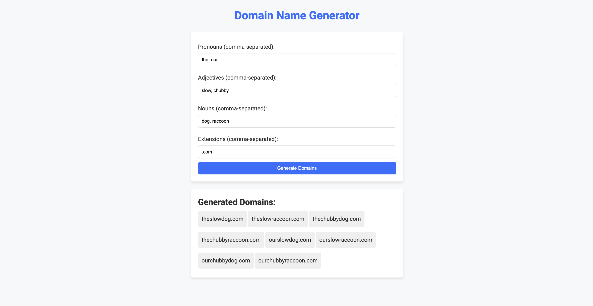

# Domain Name Generator

Have you ever found yourself stuck trying to choose the perfect domain name but have no idea where to start? Maybe you had a few ideas about what it should be related to, but nothing concrete. Or perhaps the domain you really wanted wasn’t available. In this project, you’ll build a Domain Name Generator that takes your input and creates all possible permutations, transforming your ideas into fun and unique domain names you can use for your website! 🎉

🗒️ **How to Start This Project?**
---
1. **Ensure You Have a GitHub Account**
   If you don't have one, sign up at [https://github.com](https://github.com/).
2. Navigate to the project template
   - Create a repository from the template to your account
   - Open the project with a new codespace
   - Once you did it once you can open the codespace that was previously created.
---

📝 **Instructions**
---
Build a simple web page that generates all possible domain name combinations based on user input. The page already includes a form where users can input their desired pronouns, adjectives, nouns, and extensions. Basic CSS is provided to style the page, and the JavaScript handles splitting these inputs into arrays.

Your task is to write the logic that generates all permutations of these arrays and transforms them into domain names dynamically. The result should display a list of possible domain names on the page.

Here is an example: 

---

### Hints:
- Use nested loops or high-order functions like forEach() to create permutations.
- Concatenate strings in the format: pronoun + adjective + noun + extension.

### **🤔 What to Do If You Are Stuck?**
#### **Review Fundamentals:**
- Review the JS materials covered.
#### **Ask for Help:**
- Reach out to your instructor or peers for assistance

---
### **📚 Fundamentals Covered**
#### This exercise covers the following fundamentals:
1. **HTML Basics**
    - Setting up an HTML file with a placeholder for dynamic content.
2. **CSS**
    - Styling the excuse display area for better visual appeal.
3. **JavaScript Basics:**
    - Arrays: With lists of data.
    - Loops: Using forEach() or other iteration methods for clean logic.
    - String Concatenation: Combining array elements into domain names.
    - DOM Manipulation: Dynamically updating the web page with generated results.
---

### **✅ Submission Checklist**
- [ ] JavaScript uses forEach() or loops to generate domain names dynamically.
- [ ] Arrays include at least three creative elements for each component (e.g., pronouns, adjectives, nouns).
- [ ] The project runs without errors in the browser.
- [ ] The code is clean, well-organized, and includes helpful comments.